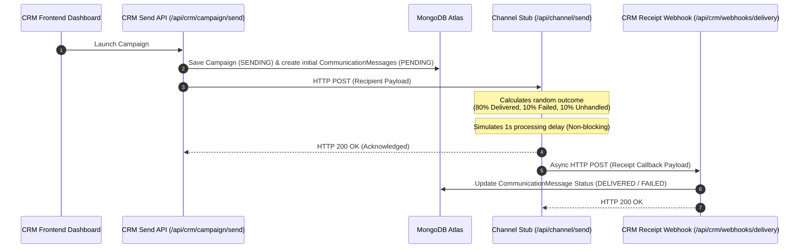

# Xeno CRM — AI-Native Mini CRM

An AI-native CRM built for consumer brands to segment shoppers and dispatch highly personalized campaigns. It simulates a decoupled CRM backend and messaging gateway provider to test full-cycle campaign dispatching and webhook ingestion.

---

## Tech Stack
* **Framework:** Next.js (App Router)
* **Language:** TypeScript
* **Styling & UI:** Tailwind CSS & shadcn/ui
* **Database:** MongoDB (via Mongoose ODM)
* **AI Engine:** Gemini API (using `gemini-flash-latest`)

---

## Core Architecture & The Webhook Loop
To optimize for deployment simplicity and developer velocity, we logically separated the CRM and Channel services using Next.js API route groups (`/api/crm` and `/api/channel`). This simulates two distinct services running across a network boundary within a single application codebase.

When a campaign is launched, the system goes through an asynchronous loop to execute the campaign, dispatch payloads, calculate delivery outcomes, and ingest delivery receipts:



### Flow Breakdown
1. **Initiation:** The marketer triggers campaign execution from the front-end wizard.
2. **Persistence:** The CRM Send API sets the campaign status to `SENDING` and inserts a `CommunicationMessage` for each matched user with a `PENDING` status.
3. **Dispatch:** The CRM calls the Channel Stub API route via an HTTP POST request.
4. **Outcome Simulation:** The Channel Stub marks the message as `SENT` locally, introduces a simulated network delay, and randomly determines the delivery outcome (80% DELIVERED, 10% FAILED, 10% NO CALLBACK).
5. **Ingestion Loop:** The Channel Stub makes an asynchronous POST call back to the CRM Receipt Webhook with the tracking payload.
6. **State Resolution:** The CRM Receipt Webhook updates the database status of the corresponding `CommunicationMessage` to `DELIVERED` or `FAILED`.

---

## The AI-Native Approach
Our product strategy uses the large language model (Gemini) primarily as a co-pilot for drafting highly personalized messaging based on audience intent and criteria. 

Rather than delegating autonomous decision-making or critical system flow control to an LLM—which can introduce latency, non-deterministic routing, and prompt injection vulnerabilities—we maintain deterministic application business logic. The LLM serves to draft hyper-focused copy variants, preserving a reliable user experience while introducing AI personalization.

---

## Authentication & Route Security
To protect customer profiles and telemetry data, the CRM utilizes a zero-dependency JWT authentication gate built with standard Web Crypto APIs (`crypto.subtle`) and Next.js Middleware.

* **Session Tokens:** On valid authentication, the CRM issues a signed HMAC-SHA256 JWT cookie (`token`) marked as `HttpOnly`, `Secure`, and `SameSite=Lax` to prevent client-side token leaks.
* **Middleware Interceptor:** A global `middleware.ts` guards dashboard, customer, builder, and analytics pages, routing unauthenticated visitors to `/login`.
* **API Protection:** Inquiries targeting protected endpoints (`/api/crm/...`) return a `401 Unauthorized` JSON payload to fetch clients when sessions are invalid, bypassing public webhook callbacks and data seeders.
* **Recruiter Demo Access:** A guide box presents credentials directly on the login interface for quick testing:
  - **Username:** `admin@xeno.co` (or `admin`)
  - **Password:** `admin123`

---

## Database Schema
The database uses MongoDB through Mongoose schemas structured as follows:

### Customer
Stores shopper demographic and spending profiles for audience query matching.
* `name` (String)
* `email` (String)
* `phone` (String)
* `totalSpends` (Number)
* `visits` (Number)
* `lastVisitDate` (Date)

### Order
Tracks customer purchase history.
* `customerId` (ObjectId, ref: `Customer`)
* `amount` (Number)
* `date` (Date)

### Campaign
Maintains marketing campaigns and rules configured by the user.
* `name` (String)
* `audienceRules` (Mixed/JSON rules array)
* `size` (Number)
* `status` (`DRAFT` | `SENDING` | `SENT`)
* `generatedMessage` (String)

### CommunicationMessage
Logs individual message dispatches and tracks delivery receipt states.
* `campaignId` (ObjectId, ref: `Campaign`)
* `customerId` (ObjectId, ref: `Customer`)
* `status` (`PENDING` | `SENT` | `DELIVERED` | `FAILED`)
* `channel` (String, default: `"WhatsApp"`)
* `messageText` (String)

---

## System Design Tradeoffs & Scale Assumptions
* **Infrastructure Separation:** At scale, the channel service would exist in a completely separate repository/infrastructure, and the webhook ingestion would utilize a message queue (like AWS SQS, Kafka, or Redis) to handle high-throughput delivery callbacks without blocking or dropping requests. For this scope, direct HTTP calls between API routes simulate that network boundary.
* **Serverless Execution Limits:** Because serverless functions (like Vercel API routes) have execution timeouts, executing database queries and sending batches of HTTP requests in a single serverless function invocation is not viable for large scale. In production, this batching process would be dispatched to background workers or a serverless queue worker (e.g., Ingest, BullMQ, or AWS Lambda + SQS).

---

## Local Setup & Run Instructions

### 1. Clone & Install Dependencies
Install all package dependencies:
```bash
npm install
```

### 2. Configure Environment Variables
Create a `.env.local` file in the root directory:
```bash
cp .env.example .env.local
```

Populate the following variables inside `.env.local`:
```env
MONGODB_URI=mongodb+srv://<username>:<password>@cluster.mongodb.net/xeno-crm
GEMINI_API_KEY=your_gemini_api_key
NEXT_PUBLIC_APP_URL=http://localhost:3000
JWT_SECRET=your_custom_jwt_secret_key_here
```

### 3. Seed Mock Database Data
Before launching campaigns, you must populate the database with realistic sample customers and order records. Start the dev server and hit the seed endpoint in your browser or client:
```
GET http://localhost:3000/api/seed
```
*This inserts 20 realistic customers and 50 random orders, establishing the data needed to perform segment matching.*

### 4. Start the Application
Run the Next.js development server:
```bash
npm run dev
```
Open [http://localhost:3000](http://localhost:3000) in your browser.

